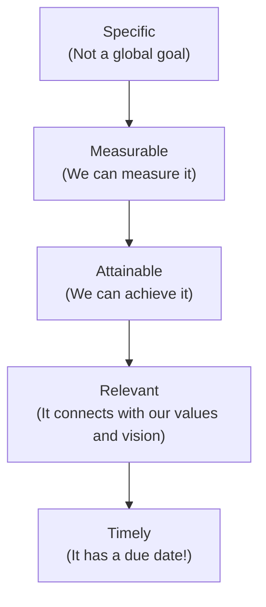
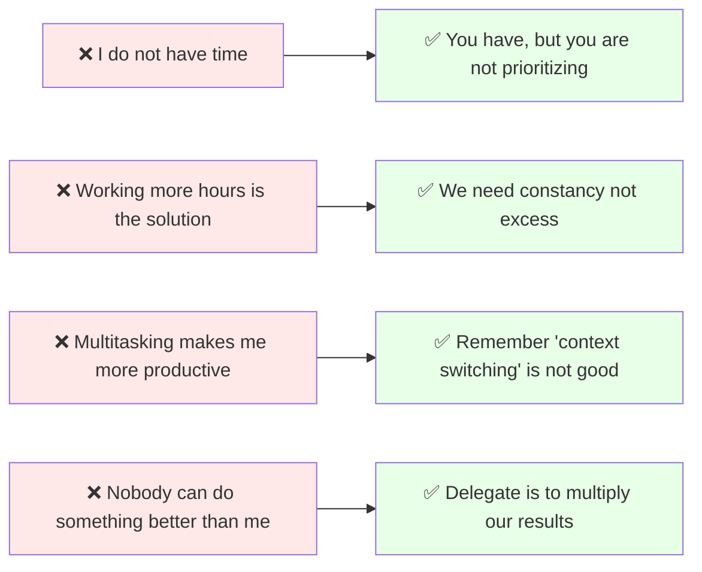

# Time Management 

Medium published version → [You Have The Same 24 Hours As Everyone Else: Stop Blaming The Clock](https://medium.com/p/c93f2befde2b)
## What This Is

Time management is the practice of organizing and planning how to divide your time between specific activities to maximize productivity and achieve goals efficiently.

Normally everybody has more things to do than hours in a day, and the problem is that we cannot increase the time but we can decide in what activities we invest it.

To help us decide and invest our time better we have 4 time managament pillars

## Time Management Pillars 

1. Strategic Planning.
2. Clear Goals
3. Smart Prioritization.
4. Execution and Follow-up

### Strategic Planning (gives us clarity)

You cannot manage your time if you don’t know where you are going. As Brian P. Moran says in The 12 Week Year: “Nothing great is ever accomplished without first being preceded by a big vision.” [the-12-week-year-summary]

### Clear Goals (gives us focus)

We need to have well defined goals, and for this we can use the smart method

### Smart Prioritization 

Prioritizing does not mean do more things, it means doing the correct thing at the appropriate time.

We can use the Eisenhower Matrix to know how to prioritize a task

Eisenhower Matrix:

![[03-resources/img/eisenhower_matrix.png]]

Quick Wins: sometimes you can do tasks with low effort and high impact, do those ones first!

#### Delegation

* If someone else can do 70% of a task as well as you would do it, you can delegate it.
* Delegating is “release” not “abandon”.

#### Learn to Say “No”

Every time you say “Yes” to something that doesn’t help your goal, you are saying “Yes” to something that doesn’t matter. Saying “No” doesn’t make you a bad person; it makes you strategic. Leave space for the things that are worth it.

#### Procrastination

Did you know we usually procrastinate because of feelings, not laziness? We avoid tasks because we feel bored, anxious, or insecure. This is called Hyperbolic Discounting: we prefer a small, immediate reward (checking TikTok) over a large, delayed reward (finishing a project).

Here are 3 strategies to fix this:

1. Split the task: Don’t look at the huge mountain. Break it into 30 or 45-minute blocks (Pomodoro technique).

2. Get an Accountability Partner: A study by the Association for Talent Development (ATD) showed that you have a 65% chance of success if you commit to someone else. If you set a specific follow-up appointment with them? Your success rate jumps to 95%.

3. Use Dopamine: Give yourself a small reward when you finish a task. A coffee, a song, or a walk.

### Execution and Follow-up

This is where the real work happens, it is good to have a plan every day of the things that I want to accomplish.

#### Protect Your Flow State
Multitasking is a lie. Research from UC Irvine shows that if you get interrupted, it takes an average of 23 minutes to regain deep focus. This is the hidden cost called “Context Switching.” Protect your focus by removing distractions and organizing your space. Remember that when our attention is fragmented, our time is too.

#### Follow-up and Retrospective

You cannot improve what you do not measure. This step is the only way to confirm if you are on the right path.

#### Follow-up
Establish clear metrics and perform periodic checks (weekly revisions). Document what you are learning and optimize your process.

#### Retrospective
At the end of the week, take a moment to acknowledge your achievements, identify the challenges you faced, define what you learned, and close the cycle with purpose.

### Myths that sabotage your productivity

